# 1. 팀소개 
## 팀명 : 👹데이터 헌터스👹
"데이터를 사냥하듯 분석하여 이탈의 원인을 찾아내는 팀"

## 팀원 소개
| 주수빈 | 임산별 | 박민정 | 김준협 | 김수현 |
|:---:|:---:|:---:|:---:|:---:|
|  |  |  |  |  |
|[@Subin-Ju](https://github.com/Subin-Ju)|[@ImMountainStar](https://github.com/ImMountainStar)|[@minjeon](https://github.com/minjeon)|[@use08168](https://github.com/use08168)|[@K-SH98](https://github.com/K-SH98)|

  

# 2. 프로젝트 개요 

## "온라인 대학 수강 플랫폼 drop(이탈) 여부 예측" #
: 온라인 대학교 강의 수강 데이터를 활용한 대학생들의 강의 drop(이탈) 여부 예측 및 대응 방안 논의

## <🚀 프로젝트 배경>

> 출처 : ['이수율 3.31%' 온라인 강의가 넘어야할 한계](https://www.globalepic.co.kr/view.php?ud=2021011021453269595796a9480c_29)

2021년, 코로나 19로 인해 온라인 수업이 확대된 지 1년 가까이 지난 시점에 나온 기사이지만, 이때 당시 온라인 강의 이수율은 불과 3.31%에 불과했습니다.  

물론 이 수치는 학점과 직결되는 대학생들의 강의, 고입/대입 진학에 좋은 성적이 필수적인 중/고등학생들의 수업 이수율 뿐만 아니라 일반 시민들이 새로운 내용을 학습하고자 수강하는 KMOOC 등의 비대면 원격 강의 이수율이 포함되었다는 점에서 정확하지 않을 수 있지만, 그럼에도 불구하고 한 강의를 100명이 듣는다고 가정했을 때 이를 수료하는 사람이 단 3명에 그친다는 것은 충격적인 결과가 아닐 수 없습니다.  

코로나가 끝난지 어언 2년차, 이제 대학에서 온라인 강의를 수강하는 모습은 거의 볼 수 없습니다. 대부분이 코로나 이전의 대면 강의로 돌아왔고, 일부 교양 / 전공 과목에서만 실시되고 있지만 이들이 강의를 이탈하지 않도록 하는 것은 대학에도 매우 중요한 부분이 아닐 수 없습니다. 학생들이 도중에 이탈하는, 소위 말하는 '강의 드랍(drop)' 행위는 대학의 등록금 반환이라는 비용 문제와 더불어 학생의 이수율과도 직결되는 문제이기 때문입니다.

## <📌 프로젝트 소개>
이에 본 프로젝트의 목적은 다음과 같습니다.

① **비용 완화** : 사전에 온라인 강의에서 이탈할 학생을 예측하여 구독 환불 비용 부담 완화  
② **수료율 향상** : 이탈 위험이 높은 학생을 확인할 시 조기 경고 및 맞춤형 지원을 통해 수료율 향상  
③ **수강 학생 유지** : 교육 기관 및 운영자 입장에서 재학생을 오래 유지할 수 있는 전략 수립 가능  

## <🎯 프로젝트 목표>
<mark>**학생의 기본 정보**를 토대로 **사전에 정확한 학생 이탈**을 예측하는 모델 개발<mark>

 

# 3. 기술스택
| **분류**         | **기술/도구**                                                                            |
|------------------|------------------------------------------------------------------------------------------|
| **언어**         |      |
| **라이브러리**   |                 
| **협업 툴**      | 

   

# 4. WBS

 

# 5. 원본 데이터에 대한 분석
## 5-1. 원본 데이터 소개
| **데이터 이름**   |   **파일 형식 / 수집 방법**    |   **데이터 출처**      |
|:-----------------:|:-----------------------------:|:---------------------------------:|
| 대학교 강의 수강 데이터 |  csv / 직접 다운로드 | [UCI Machine Learning Repository ](https://archive.ics.uci.edu/dataset/349/open+university+learning+analytics+dataset) |

- 본 데이터셋(Open University Learning Analytics dataset, OULAD)은 영국 오픈 유니버시티 학생들의 학습 활동과 성적, 강의 수강 정보, 그리고 온라인 학습 환경(VLE; Virtual Learning Environment)에서의 상호작용 데이터를 포함하고 있습니다.
- 구체적으로, 7개의 강의(`code_module`)에 등록한 3만명 이상의 학생들의 데이터를 다루며, 강의 정보 / 학생 정보 / 온라인 활동 / 과제 제출 및 평가 / 등록 및 이탈 등과 관련된 여러 csv 파일로 구성되어 있습니다.  

**활용한 데이터** : `student_Info.csv` (메인), studentVle.csv, assessments.csv

 

## 5-2. 메인 원본 데이터 기본 정보 확인

### 1. 총 11개의 feature 컬럼 
| **컬럼 명** |     **컬럼 소개**   |  **컬럼 데이터 타입** |
|:-------------------:|:--------------------------------:|:------------:|
| code_module | 등록 강의 | object |
| code_presentation | 강의가 개설된 학기 구분 코드 | object |
| id_student | 학생 고유 ID | int64 |
| gender | 성별 | object |
| region | 거주 지역 | object |
| highest_education | 최고 학력 | object |
| imd_band | 다중 빈곤 지수(= 한국의 소득 1~10분위) | object |
| age_band | 연령대 | object |
| num_of_prev_attempts | 재수강하는 강의 수 | int64 |
| studied_credits | 현재 수강 학점 | int64 |
| disability | 장애 여부 | object |

### 2. target 컬럼 : 탈퇴 여부 `final_result`  
: final_result는 총 4개의 결과값( `Withdrawn(탈퇴)` / `Fail(낙제), Pass(통과), Distinction(우수 수료)` )가 존재함.

### 3. 행동 특성 및 이상치 여부 확인  
#### 3-1. 행동 특성 중 과목(code_module) 확인
  
: AAA(0)부터 GGG(6)까지 7개의 과목별 final_result의 분포 확인 가능  
=> 학생들이 대부분 BBB(1)와 FFF(5) 과목을 많이 수강했음을 확인  
=> 대개 수강 학생이 많은 과목일수록 이탈한 학생(1) 수도 많은 편(비례적). 그러나 CCC(2)와 DDD(3) 과목에서 다른 과목에 비해 이탈하지 않은 학생 대비 이탈한 학생의 수가 많아 보이는 것을 파악 가능

#### 3-2. studied_credits 이상치 확인 및 제거
  
: 수강 학점(studied_credits)의 분포를 확인한 결과, IQR 범위를 벗어나는 이상치들이 많은 것을 확인  
=> 이상치 제거 진행

#### 3-3. 등록일/탈퇴일 데이터 확인 및 제거
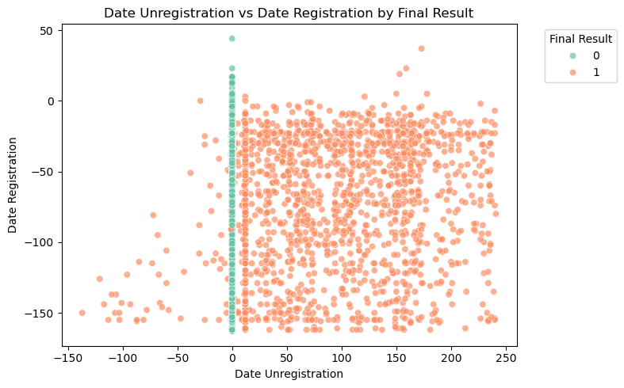  
: 시작일 기준 등록일(date_registration)과 시작 기준 탈퇴일(date_unregistration) 데이터의 final_result 분포 확인  
=> 중도 이탈한 학생들(`final_result == 0`)은 탈퇴일 데이터가 존재할 것이고, 수료한 학생들(`final_result == 1`)은 탈퇴일 데이터가 존재하지 않을 것  
  => 너무나 당연한 행동 특성 데이터이므로 뚜렷한 경향성 → 학습에 큰 도움 X → 제거 필요

  

# 6. 데이터 전처리 및 데이터 전처리 결과서 (EDA)
- studentInfo.csv 파일에 studentVle.csv, assessments.csv 파일을 추가로 활용
- final_result(Pass, Fail, DIsticntion : 0 | Withdrawn : 1 → drop_status 타겟 컬럼으로 생성)
- 안쓰는 컬럼(행동 데이터)인 code_module, code_presentation, num_of_prev_attepts, studied_credits 컬럼 삭제
- 모든 컬럼 값이 같은 중복 행 제거
- 한 학생이 dropout_status 0과 1을 모두 가지고 있는 행 제거
- 범주형 변수 라벨 인코딩 진행 (gender, disability, age_band, highest_education, imd_band, region)

 

## 6-1. 타겟 컬럼 데이터 분포

**타겟값(dropout_status) 분포 확인**  
: 전체 데이터의 약 32%의 학생들이 수강 도중 이탈했고, 약 68%의 학생들이 끝까지 수료했음을 확인

 

### 6-1-1. 학생의 고유 특성과 타겟 컬럼 비교

**1. gender vs final_result**  
: 여성(0)과 남성(1)에서 각각 final_result의 분포 확인 가능  
=> 남성과 여성 모두 이탈하지 않은 학생(0)의 수가 이탈한 학생(1) 수보다 두 배 이상 많음

 

**2. region vs final_result**  
: 거주 지역(region) 별로 final_result의 분포 확인 가능  
=> 전반적으로 이탈하지 않은 학생 수가 이탈한 학생 수보다 월등히 많았음. 그러나 지역별로 격차가 존재했는데, 특히 0번 지역과 6번 지역, 10번 지역에서 그 차이가 큼

 

**3. highest_education vs final_result**  
| highest_education level | 라벨 인코딩 | 의미 | 
|:------------------------:|:------------:|:-------------:|
| No formal quals | 0 | 공식 학위 없음 |
| Lower than A level | 1 | A레벨 미만 (초, 중학생) |
| A Level or Equivalent | 2 | A레벨 또는 동등 자격 (고교 재학 중 / 고교 졸업) |
| HE Qulification | 3 | 대학교 졸업 (학사 이상) |
| Post Graduate Qualification | 4 | 대학원 졸업 (석/박사 이상) |

: 교육 수준의 차이에 따른 final_result의 분포 확인 가능  
=> 교육 수준이 낮은 축에 속하는 학생들이 강의를 월등히 많이 수강함 (0~2 레벨 사이)  
=> 2레벨(고등학생 or 고등학교 졸업) 수준의 학생들에서 가장 많은 이탈자 발생

 

**4. imd_band vs final_result**  
: 소득 분위(imd_band) 별 final_result의 분포 확인 가능  
=> 대체적으로 소득 분위별 수강 인원은 비슷한 것으로 파악됨  
=> 그러나 소득 분위가 낮은 쪽(1~3분위 구간)에서 이탈자가 많이 발생 → 10분위로 갈수록 점차 이탈자 그래프가 작아짐(= 이탈자 감소)

 

**5. age_band vs final_result**  
| age_band | 라벨 인코딩 | 의미 |
|:---------:|:---------:|:-------:|
| 0 - 35 | 0 | 0세 이상, 35세 미만|
| 35 - 55 | 1 | 35세 이상, 55세 미만 |
| 55 <= | 2 | 55세 이상 |

: 연령대(age_band) 별 final_result의 분포 확인 가능  
=> 다수가 교육 수준 0, 1, 2레벨에 해당할 것으로 파악되는 0~35세 연령대에서 가장 많은 온라인 강의를 수강. 높은 연령대로 갈수록 수강 인원이 현저히 감소

 

**6. disability vs final_result**  
: 장애 여부(disability) 별 final_result의 분포 확인 가능  
=> 장애가 없는 학생(0)의 현저히 높은 강의 수강량  
=> 비율로만 보았을 때, 장애가 있는 학생(1)의 이수 대비 이탈률이 장애가 없는 학생(0)의 이수 대비 이탈률보다 높음

 

# 7. 머신러닝 학습 결과서
## 7-1. 기본 전처리 데이터 머신러닝
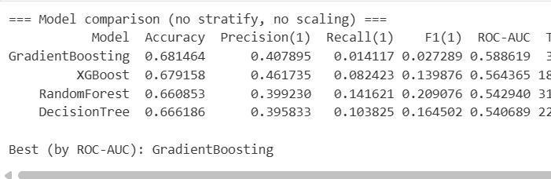

**전처리까지만 한 데이터 프레임으로 모델 성능 평가**  
- 사용한 모델 종류 : `GradientBoosting`, `XGBoost`, `RandomForest`, `DecisionTree`, `KNN`, `GNB`
    - 이 중, 성능이 잘 나오지 않았던 `KNN` 과 `GNB` 제외

 

## 7-2. 성능 향상을 위한 노력들(1) - 고유 특성만 고려
### (1) Polynomial Features 생성
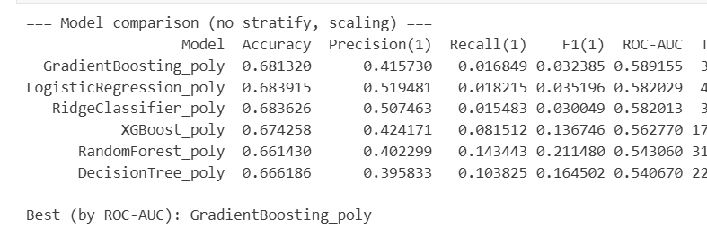

**성능 향상 시도 : Polynomial Features(다항 특성) 생성**  
- Polynomial Features를 활용해 원래 있던 feature 값들의 다항 확장을 진행.  
**그러나** 숫자형 변수와 선형모델(Logistic Regression, RidgeClassifier)에만 영향을 미침 → 성능 향상 미비

 

### (2) Polynomial Features + 적은 범위의 GridSearchCV → 하이퍼파라미터 튜닝
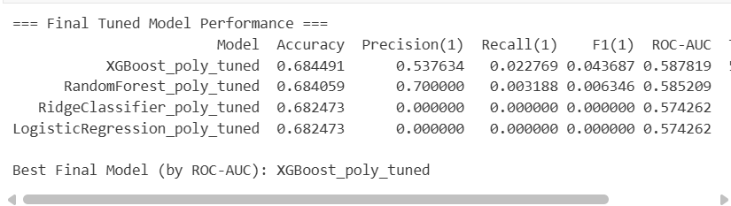
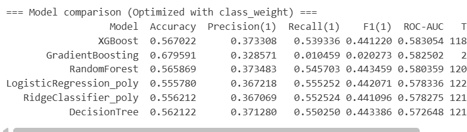

**성능 향상 시도 : 하이퍼파라미터 후보값을 좁게 설정하여 최적의 조합 발견 시도**  
✅ XGBoost, RandomForest 모델의 성능은 향상  
❌ RidgeClassifier, LogisticRegression 모델의 성능은 하락  
=> 일단 최고 성능인 XGBoost의 정확도, 재현율 등 전반적인 성능은 1차 시도에 비해 향상됨  
⚠️ **그러나** 동일한 class weight 최적화를 통한 비교 시에는 XGBoost의 정확도와 재현율이 크게 하락 (약 10% 정도)

 

### (3) Polynomial Features + 파생 변수 추가 + GridSearchCv → 하이퍼파라미터 튜닝
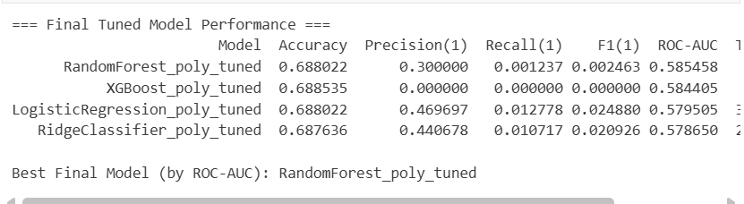
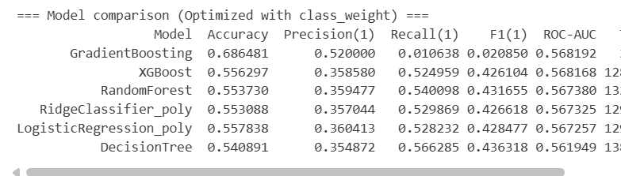  

**성능 향상 시도 : 기본 feature를 활용해 27개의 파생 변수를 추가해봄**  
✅ XGBoost, RandomForest, RidgeClassifier, LogisticRegression 모두 성능 향상 (약 68% 대로 진입)  
✅ class weight 최적화를 통한 비교 결과도 2차 시도에 비해 향상됨  
=> 일반 모델 성능 평가 최고 성능 : RandomForest | class weight 최적화 최고 성능 : GradientBoosting  
❌ 그런데, RandomForest의 경우 이전에 비해 재현율을 비롯한 다른 수치가 크게 하락  
=> 3차 시도 결과 최고 성능 : GradientBoosting

 

### (4) Polynomial Features + 앙상블 모델 적용

  
  

**성능 향상 시도 : 앙상블 모델 적용**  
여기에 설명을 적어주세요

 

### (5) Polynomial Features + 파생 변수 + 앙상블 모델 적용

  

**성능 향상 시도 : 파생 변수 추가 후 앙상블 모델 적용**  
여기에 설명을 적어주세요

 

### 성능 향상 시도를 통해 얻은 결과
**Accuracy(정확도)와 Recall(재현율)에 대한 정의**  
`Accuracy` : 전체 데이터 중 모델이 맞게 예측한 비율  
`Recall` : 실제로 긍정(1)인 것 중 긍정으로 올바르게 예측한 비율.  

Q. 재현율이 0에 가깝다?  
A. 이탈을 전혀 잡아내지 못하고 있다. Accuracy(정확도)는 0인 데이터가 많기 때문에 0과 1중 0으로만 예측해도 높게 나올 수밖에 없음.  
💡 <mark>모델의 성능 평가 지표를 **재현율**로 보자!<mark>

 

## 7-3. 성능 향상을 위한 노력들(2) - 행동 특성 추가
### (1) 행동 특성을 포함한 XGBoost
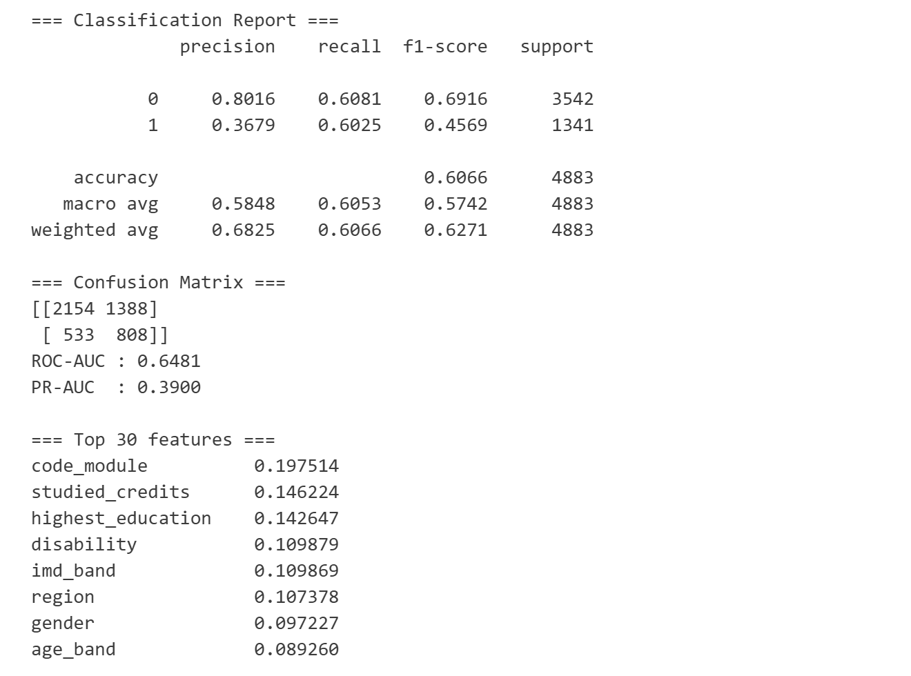  

**성능 향상 시도 : 제거했던 행동 특성 추가 후 XGBoost 모델 학습**
여기에 설명을 적어주세요

 

### (2) 행동 특성 포함 XGBoost + Optuna
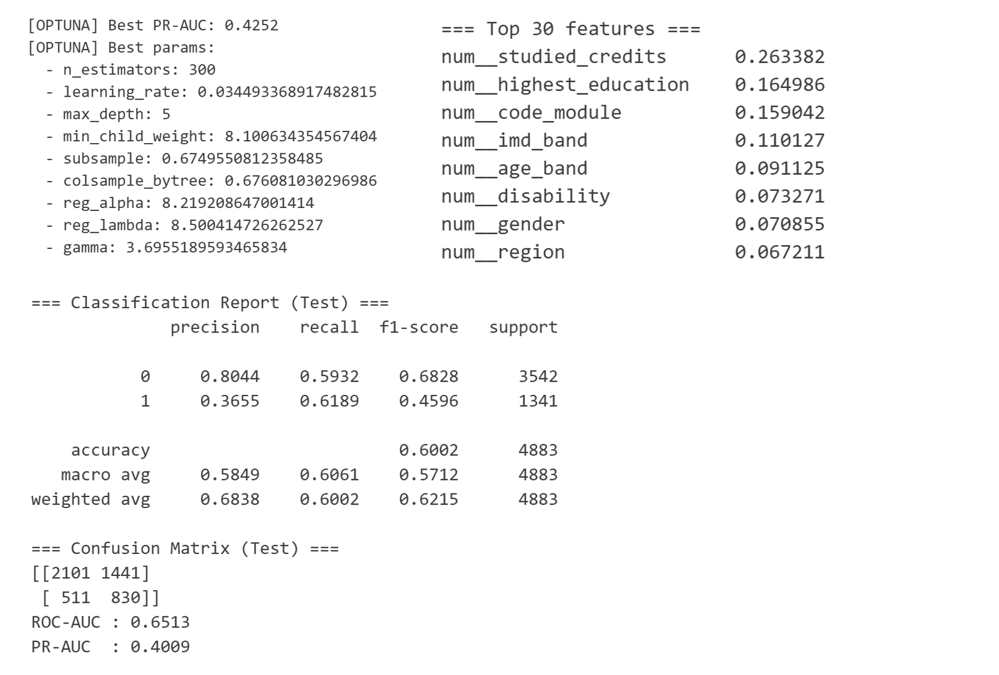  

**성능 향상 시도 : 행동 특성 포함 후 XGBoost(Optuna를 통한 하이퍼파라미터 최적화)**
여기에 설명을 적어주세요

 

### (3) 행동 특성 포함 XGBoost + SMOTE + Optuna
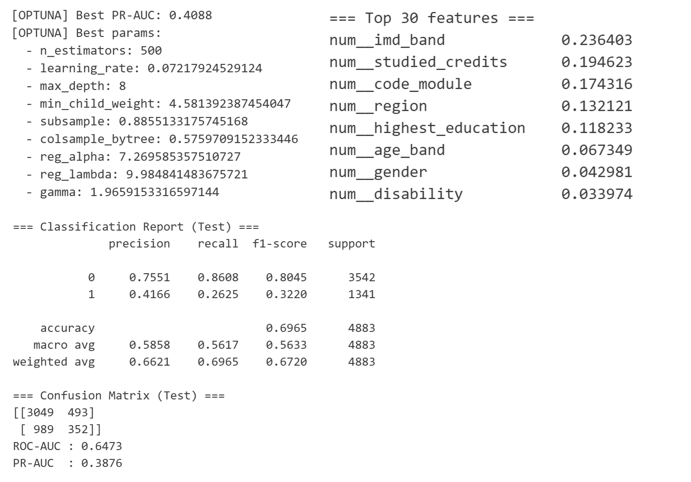  

**성능 향상 시도 : 행동 특성 포함 후 XGBoost(SMOTE : 학습 데이터 균형 맞춤 → Optuna : 최적화)**
여기에 설명을 적어주세요

 

### (4) 행동 특성 포함 XGBoost + 언더샘플링
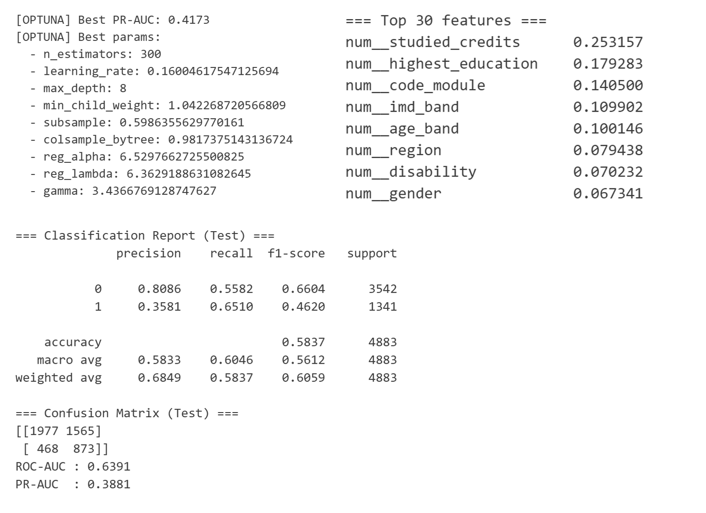  

**성능 향상 시도 : 행동 특성 포함 후 XGBoost(언더샘플링 : SMOTE와 반대로 균형 맞춤)**
여기에 설명을 적어주세요

  

# 8. 정제 데이터와의 비교
## 비교 목적  
**오차 행렬** : 우리가 원하는 타겟 = 1(이탈). 그러나 recall 값이 낮고, precision 값이 높음 (상충관계)
기존 데이터를 활용한 5번의 성능 향상 시도, 행동 특성을 포함한 데이터로 4번의 성능 향상 시도를 통해 총 10번에 걸친 성능 평가 및 향상 시도를 진행했으나 그럼에도 불구하고 여전히 recall 값이 기준치(70%)를 넘지 못함.  

이는 곧, 모델이 너무 보수적으로 이탈자를 예측하여 타겟이 1이 아닌 상황(== 0인 상황)을 파악하지 못하는 문제에 도달.  
SMOTE를 적용하니 오히려 0에서의 TP(긍정 예측-예측 일치)값이 증가 → 언더샘플링과 Threshold를 진행.  
그럼에도 precision(정밀도; 예측이 틀리지 않는 능력) 향상 X → **데이터의 문제이지 않을까?**  

이에, kaggle에서 비슷한 주제의 정제된 데이터를 갖고 모델 학습 후 성능 평가의 과정을 거쳐 비교를 진행하고자 함.

 

## kaggle 데이터 : XGBoost + 언더샘플링 모델
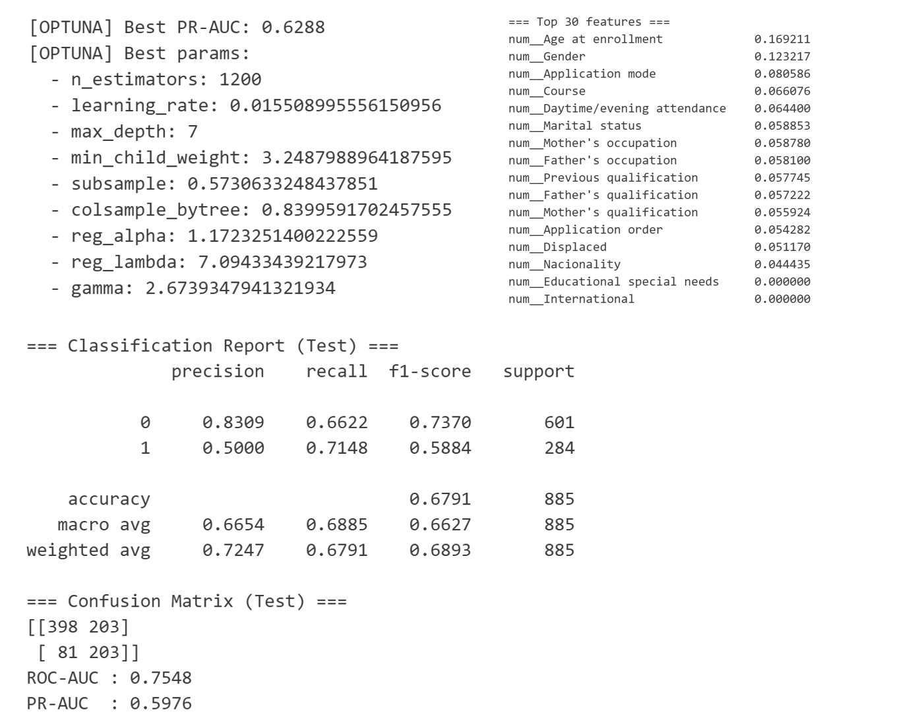  

#### 결과 설명  
여기에 결과를 적어주세요

  

# 9. 한계점 및 보완점
## 9-1. 한계점

 

## 9-2. 보완점

  

##  😎**팀원 한 줄 회고**
| 이름 | 내용 |
|:------:|:---------|
| 주수빈 | 개인정보보호가 중요한 세상인 만큼, 고객의 고유 특성이 존재하는 데이터를 찾기가 매우 어려웠으며, 모델 학습을 위한 데이터 가공 과정부터 많은 난관이 존재했다. 68%에서 멈춘 성능을 향상시키고자 고유 특성만 활용한 파생 변수 생성, PCA, 컬럼 추가 등등 정말 많은 시도를 했지만 기대한 것 만큼 모델의 성능 향상이 이루어지지 못한 것은 아쉬운 점으로 남았다. 한편 프로젝트 진행 과정 초기에 행동 데이터를 제거하지 않고 모델링을 진행했을 때 굉장히 높은 성능을 내는 경우가 많아 당황했는데, 이를 통해 고객의 이탈 예측에는 행동 데이터가 매우 큰 변수로 작용하고 있음을 깨달았다. 그제서야 왜 많은 가입을 요하는 페이지들이 신규 가입 혜택을 주고, 장기 회원에게는 VIP 혜택을 주는지를 몸소 체험할 수 있었다. |
| 임산별 | |
| 김민정 | |
| 김준협 | |
| 김수현 | 이번 프로젝트를 통해 데이터 수집의 어려움을 직접 겪으며 ‘정보가 곧 돈’이라는 사실을 절실히 깨달았다. 또한 모델마다 성능이 천차만별로 달라 최적화를 위해 파생 변수를 생성하는 등 다양한 시도를 했지만, 기대만큼 성능 향상이 쉽지 않다는 점이 아쉬웠다. |

