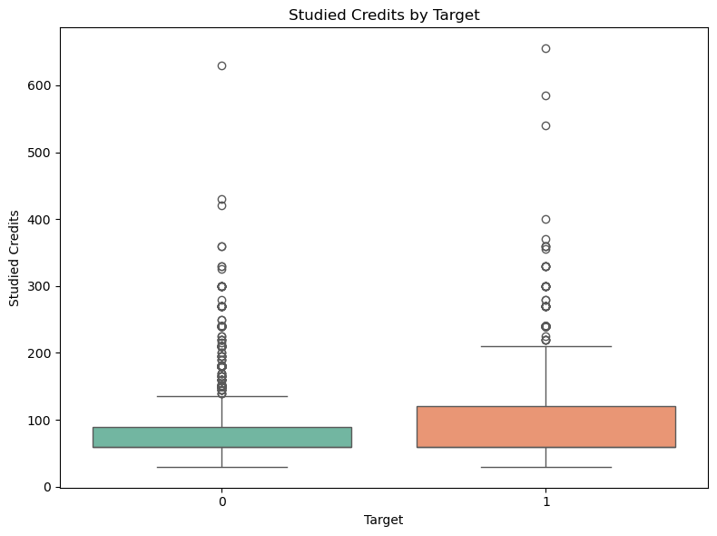
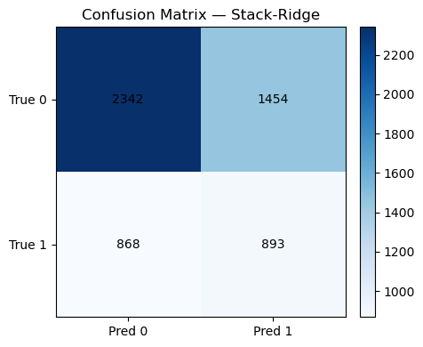

# 1. 팀소개 
## 팀명 : 👹데이터 헌터스👹
"데이터를 사냥하듯 분석하여 이탈의 원인을 찾아내는 팀"

## 팀원 소개
| 주수빈 | 임산별 | 박민정 | 김준협 | 김수현 |
|:---:|:---:|:---:|:---:|:---:|
|  |  |  |  |  |
|[@Subin-Ju](https://github.com/Subin-Ju)|[@ImMountainStar](https://github.com/ImMountainStar)|[@minjeon](https://github.com/minjeon)|[@use08168](https://github.com/use08168)|[@K-SH98](https://github.com/K-SH98)|

사진출처 : 넷플릭스
# 2. 프로젝트 개요 

## "온라인 대학 수강 플랫폼 drop(이탈) 여부 예측" #
: 온라인 대학교 강의 수강 데이터를 활용한 대학생들의 강의 drop(이탈) 여부 예측 및 대응 방안 논의

## <🚀 프로젝트 배경>
  

> 출처 : ['이수율 3.31%' 온라인 강의가 넘어야할 한계](https://www.globalepic.co.kr/view.php?ud=2021011021453269595796a9480c_29)  
> 출처 : [‘코로나19 이후 떠오르는 온라인 교육 시장’](https://www.newswire.co.kr/newsRead.php?no=913257&sourceType=mail)

- **온라인 교육 시장 성장**
  - 코로나 19 이후 전 세계 40개국 온라인 교육 종사자 90%가 '주 수입원으로 온라인 교육을 활용한다'고 응답

- **이수율 저하**
  - 실제 글로벌 통계에 다르면 온라인 강의의 평균 이수율 3.31%에 불과
  - 학습 지속 의욕 저하와 플랫폼 신뢰도 하락으로 연결
  - 플랫폼 운영사 구독 환불로 인한 재정적 부담 증가

## <📌 프로젝트 목적>
이에 본 프로젝트의 목적은 다음과 같습니다.
- 이탈 위험군 조기 식별  
① **비용 완화** : 사전에 온라인 강의에서 이탈할 학생을 예측하여 구독 환불 비용 부담 완화  
② **수료율 향상** : 이탈 위험이 높은 학생을 확인할 시 조기 경고 및 맞춤형 지원을 통해 수료율 향상  
③ **수강 학생 유지** : 교육 기관 및 운영자 입장에서 재학생을 오래 유지할 수 있는 전략 수립 가능  

## <🎯 프로젝트 목표>
<mark>**학생의 기본 정보**를 토대로 **사전에 정확한 학생 이탈**을 예측하는 모델 개발<mark>

 

# 3. 기술스택
| **분류**         | **기술/도구**                                                                            |
|------------------|------------------------------------------------------------------------------------------|
| **언어**         |      |
| **라이브러리**  |                 
| **협업 툴**      | 

   

# 4. WBS

 

# 5. 데이터 소개 
## 5-1. 데이터 출처 및 구성
| **데이터 이름**   |   **파일 형식 / 수집 방법**    |   **데이터 출처**      |
|:-----------------:|:-----------------------------:|:---------------------------------:|
| 대학교 강의 수강 데이터 |  csv / 직접 다운로드 | [UCI Machine Learning Repository ](https://archive.ics.uci.edu/dataset/349/open+university+learning+analytics+dataset) |

- 본 데이터셋(Open University Learning Analytics dataset, OULAD)은 영국 오픈 유니버시티 학생들의 학습 활동과 성적, 강의 수강 정보, 그리고 온라인 학습 환경(VLE; Virtual Learning Environment)에서의 상호작용 데이터를 포함하고 있습니다.
- 구체적으로, 7개의 강의(`code_module`)에 등록한 3만명 이상의 학생들의 데이터를 다루며, 강의 정보 / 학생 정보 / 온라인 활동 / 과제 제출 및 평가 / 등록 및 이탈 등과 관련된 여러 csv 파일로 구성되어 있습니다.  
- 이용자의 기본 특성이 포함된 데이터 파일 우선 선택

 

- **활용한 데이터** : `student_Info.csv` (메인), studentVle.csv, assessments.csv

# 6. 데이터 전처리 
## 6.1 StudentID 중복 행 제거 
1) 데이터 파일 합치기
   

  - 각 이용자별 학기별/과목별/과제별로 행이 나뉨
  - 각 이용자별 하나의 행으로 재구성

2) 두 학기 이상을 수강한 학생 중 만나이 변동
   - 두 학기 이상을 수강한 학생 행 제외 & 나이 값이 2개인 학생은 과거의 값(이용자의 초기 가입 나이)만 선택

## 6.2 Target 칼럼 생성 
- finall_result 칼럼의 값 `Withdrawn(탈퇴)` / `Fail(낙제), Pass(통과), Distinction(우수 수료)` 중 Withdrawn(탈퇴)를 이탈로 간주
- Pass, Fail, Disticntion : 0 | Withdrawn : 1 으로 label encoding
- 이용자 중 final_result에 0과 1을 모두 가진 이용자는 제거
    => 이탈 : 한 학기만 탈퇴는 이탈 X , 모든 학기 탈퇴를 완전한 이탈로 간주

## 6.3 범주형 변수 Encoding 
- Label-Encoding : age_band, highest_education, imd_band, region
- One-Hot Encoding : gender, disability

## 6.4 이상치 제거
  #### studied_credits 이상치 확인 및 제거
| **수강 학점 분포 (이상치 포함)** | **수강 학점 분포 (이상치 제거)** |
|----------------------------------|----------------------------------|
|  |  |

## 6.5 최종 데이터 프레임 
  - 데이터 크기 : 총 24411건 , 11개 행
   
  
| id_student | code_module | code_presentation | gender | region | highest_education | imd_band | age_band | studied_credits | disability | target |
|------------|-------------|-------------------|--------|--------|-------------------|----------|----------|-----------------|------------|--------|
| 3733       | 3           | 1                 | 1      | 8      | 3                 | 10       | 2        | 60              | 0          | 1      |
| 6516       | 0           | 3                 | 1      | 6      | 3                 | 9        | 2        | 60              | 0          | 0      |
| 11391      | 0           | 1                 | 1      | 0      | 3                 | 10       | 2        | 240             | 0          | 0      |
| 23629      | 1           | 0                 | 0      | 0      | 1                 | 3        | 0        | 60              | 0          | 0      |
| 23632      | 1           | 1                 | 0      | 0      | 2                 | 5        | 0        | 60              | 0          | 1      |

 

# 7. EDA 

## 7.1. 타겟 컬럼 데이터 분포

**타겟값(dropout_status) 분포 확인**  
: 전체 데이터의 약 32%의 학생들이 수강 도중 이탈했고, 약 68%의 학생들이 끝까지 수료했음을 확인

 

### 7.2. 이용자의 개인특성 변수와 타겟변수 분석

**1) imd_band vs final_result**  
: 소득 분위(imd_band) 별 final_result의 분포 확인 가능  
=> 대체적으로 소득 분위별 수강 인원은 비슷한 것으로 파악됨  
=> 그러나 소득 분위가 낮은 쪽(1~3분위 구간)에서 이탈자가 많이 발생 → 10분위로 갈수록 점차 이탈자 그래프가 작아짐(= 이탈자 감소)

### 7.3. 행동특성 변수 추가 및 EDA 
#### 1) 행동 특성 중 과목(code_module) 확인
  
: AAA(0)부터 GGG(6)까지 7개의 과목별 final_result의 분포 확인 가능  
=> 학생들이 대부분 BBB(1)와 FFF(5) 과목을 많이 수강했음을 확인  
=> 대개 수강 학생이 많은 과목일수록 이탈한 학생(1) 수도 많은 편(비례적). 그러나 CCC(2)와 DDD(3) 과목에서 다른 과목에 비해 이탈하지 않은 학생 대비 이탈한 학생의 수가 많아 보이는 것을 파악 가능

 

# 8. 머신러닝 학습 결과서
|  |  |
|----------------------|--------------------------------|
|  |  |
 

`Accuracy` : 전체 데이터 중 모델이 맞게 예측한 비율  
`Recall` : 실제로 긍정(1)인 것 중 긍정으로 올바르게 예측한 비율.  

Q. 재현율이 0에 가깝다는 것  
A. 이탈을 전혀 잡아내지 못하고 있다. Accuracy(정확도)는 0인 데이터가 많기 때문에 0과 1중 0으로만 예측해도 높게 나올 수밖에 없음.  
💡 <mark>모델의 성능 평가 지표를 **재현율**로 보자!<mark>

## 8.1. 기본 전처리 데이터 머신러닝

**전처리까지만 한 데이터 프레임으로 모델 성능 평가**  
- 사용한 모델 종류 : `GradientBoosting`, `XGBoost`, `RandomForest`, `DecisionTree`, `KNN`
    - 이 중 추가로 ROC가 Best인 GradientBoosting 모델의 0과 1에 대한 성능 평가  
  => 1(탈퇴)에 대한 Recall 값이 0.01로 0에 가까움

 

## 8.2. 성능 향상을 위한 노력들(1) - 고유 특성만 고려
### (1) Polynomial Features 생성

**성능 향상 시도 : Polynomial Features(다항 특성) 생성**  
- Polynomial Features를 활용해 원래 있던 feature 값들의 다항 확장을 진행.  
**그러나** 숫자형 변수와 선형모델(Logistic Regression, RidgeClassifier)에만 영향을 미침 → 성능 향상 미비

 

### (2) Polynomial Features + GridSearchCV 하이퍼파라미터 튜닝

**성능 향상 시도 : 하이퍼파라미터 튜닝으로 최적의 조합 발견 시도**  
- 선형 모델에만 Polynomial 적용 + GridSearchCV로 하이퍼파라미터 튜닝을 진행  
✅전반적으로 Acuurancy는 모두 하락했지만 Recall이 급등

 

### (3) Polynomial Features + 파생 변수 추가 + GridSearchCv 하이퍼파라미터 튜닝

  

**성능 향상 시도 : 기본 feature를 활용해 파생 변수를 추가해봄**  
- 선형 모델에만 Polynomial 적용 + 기본 특성으로만 만든 파생 변수 추가 + GrideSearchCV로 하이퍼파라미터 튜닝  
❌ 파생 변수를 추가하기 전보다 약간 하락하는 경향을 보임 

 

### (4) Polynomial Features + 앙상블 모델 적용

  
  

**성능 향상 시도 : 앙상블 모델 적용**  
위에서 성능이 좋았던 모델 3개로 Stacking 진행  

 

### (5) Polynomial Features + 파생 변수 + 앙상블 모델 적용

  
 

**성능 향상 시도 : 파생 변수 추가 후 앙상블 모델 적용**  
위와 같은 모델로 파생 변수를 추가해서 Stacking 진행  
=> 데이터 특성을 반영하기 위해 파생변수를 만들어서 사용했으나 값이 오히력 하락

 

### (6) Polynomial Features + 파생 변수 중요도 Top 10 + 앙상블 모델 적용

**결과**  

## 8-3. 성능 향상을 위한 노력들(2) - 행동 특성 추가
- 성능을 향상하기 위해 기본 특성 피쳐 데이터 프레임에 가입 초기 정보 데이터 추가
### (1) 행동 특성을 포함한 XGBoost

**성능 향상 시도 : 고객의 행동 특성 추가 후 XGBoost 모델 학습** 
- 모든 이탈을 예측하는 성능이 나옴 

 

**<성능과 직결되는 데이터 분포도 확인>**
| **date_unregistration vs final_result** | **num_assessments vs final_result** |
|----------------------------------|----------------------------------|
|  |  |

 

- 이탈을 하지 않은 학생은 date_unregistration이 모두 0 -> dete_unregistration이 0이면 final_result도 0
- 이탈을 한 학생의 num_assessments의 수는 0 ~ 2로 분포 -> num_assessments가 0 ~ 2이면 final_result 1이라고 예측 가능 

 

### (2) 행동 특성을 포함한 XGBoost (Date_unregistraion , num_assessments 제거)

**성능 향상 시도 : 고객의 행동 특성 포함 후 XGBoost(이탈 여부와 직결되는 컬럼인 Date_unregistraion, num_assessments 제거)**
- 이탈 여부와 직결되는 컬럼 삭제 후 행동 특성이 포함된 데이터 프레임 모델 성능 평가 -> 1의 Recall 값이 0.88이고 다른 모든 성능 평가 지표와 조화를 이룸

  

# 9. 한계점 및 보완점
## 9-1. 한계점
-  **온라인 플랫폼의 개인정보 수집 한계**
    - 개인정보보호 강화와 가입 장벽 완화를 위해 많은 플랫폼이 최소한의 기본 정보만 요구(ex. 카카오톡 간편 가입, 이메일 연동).
    - 온라인 플랫폼의 핵심 활동이 ‘이용자의 서비스 이용 행동’이므로, 활동데이터가 이탈 예측에서 결정적인 변수임.
    - 단순 인구통계학적 특성(성별, 연령, 지역 등)만으로는 이탈 가능성 예측이 어려우며, 초기 예측 모델의 한계로 작용
    - 이러한 활동데이터 확보 이전 단계에서는 예측력이 제한될 수밖에 없는 구조적 한계가 존재.
 

## 9-2. 보완점
- 온라인 플랫폼의 고객 특성에 적합하게 활동데이터 추가 또는 이용자의 학습성취에 영향을 끼치는 기본특성(ex.성적, 공부시간) 등을 추가하면 성능이 향상될 것으로 기대됨
- 활동변수 추가를 통해 정교한 파생변수 생성으로 모델 성능 향상 기대됨

# 10. 기대효과 
- **실무 데이터 확장 가능성**: 실제 온라인 플랫폼의 소비자의 행동 데이터를 활용하여 예측 성능을 높여 초기단계의 이탈 위험군을 조기 식별 가능
- **사전적 대응 전략 수립**: 예측된 이탈 위험 집단에 대해 **맞춤형 학습 지원·관리 전략**을 제공하여 수료율과 학습 지속성을 향상
- **마케팅 자원 최적화** : 이탈 위험군 고객을 분리하여 비즈니스 가치가 높은 고객유지에 집중하여 마케팅 리소스를 효과적으로 지원 가능
  

##  😎**팀원 한 줄 회고**
|      이름      | 내용 |
|:------------:|:----------------|
| 주수빈 | 개인정보보호가 중요한 세상인 만큼, 고객의 고유 특성이 존재하는 데이터를 찾기가 매우 어려웠으며, 모델 학습을 위한 데이터 가공 과정부터 많은 난관이 존재했다. 68%에서 멈춘 성능을 향상시키고자 고유 특성만 활용한 파생 변수 생성, PCA, 컬럼 추가 등등 정말 많은 시도를 했지만 기대한 것 만큼 모델의 성능 향상이 이루어지지 못한 것은 아쉬운 점으로 남았다. 한편 프로젝트 진행 과정 초기에 행동 데이터를 제거하지 않고 모델링을 진행했을 때 굉장히 높은 성능을 내는 경우가 많아 당황했는데, 이를 통해 고객의 이탈 예측에는 행동 데이터가 매우 큰 변수로 작용하고 있음을 깨달았다. 그제서야 왜 많은 가입을 요하는 페이지들이 신규 가입 혜택을 주고, 장기 회원에게는 VIP 혜택을 주는지를 몸소 체험할 수 있었다. |
| 임산별 | 이번 프로젝트를 통해 고객 데이터의 특징에 대해 이해하고, 데이터 전처리의 중요성을 배웠다. 또한 모델의 성능을 높이기 위해 다양한 모델을 탐색하고, 피처를 처리하면서 데이터분석의 이해도를 높였다. 하지만 주제 선정 및 데이터 선택에 있어서 도메인에 이해의 중요함을 배웠다.|
| 박민정 | 저번 프로젝트와 달리 이번 프로젝트에서는 더 다양한 모델을 시도하고 성능 향상을 위한 거의 모든 방법을 적용해본 것 같다. 이를 통해 모델별 성능 특성과 한계를 파악할 수 있었고 모델 성능 향상을 위한 방법이었지만 오히려 성능이 저하되는 경우의 원인도 분석할 수 있었다. 가입 고객의 행동 피처가 아닌 고유 특성 피처를 가진 데이터를 찾기가 매우 어려웠다. 어렵게 찾은 데이터는 파일 개수가 많고 컬럼 선정이 필요해 전처리 과정이 매우 까다로웠다. 전처리 이후 모델을 돌렸을 때 accurancy와 ROC가 50%에 불과해 무작위 예측과 유사한 성능이었고, 다양한 시도를 했음에도 acuurancy가 최대 68%에 그쳤다. 다음에 유사한 예측 프로젝트를 진행한다면 행동 데이터가 아닌, 고유 특성 컬럼이 풍부한 데이터를 선정해 머신 러닝 모델의 성능을 높이고 싶다. |
| 김준협 | 프로젝트를 통해서 머신러닝의 성능을 높이는 과정에서 부족함을 많이 느꼈습니다. 특히 각 객체들의 의미를 좀 더 명확하게 파악하고머신러닝의 결과를 바탕으로 어떤 방향으로 머신의 성능을 높이는 방법을 더 공부해야 겠다고 느꼈습니다. |
| 김수현 | 이번 프로젝트를 통해 데이터 수집의 어려움을 직접 겪으며 ‘정보가 곧 돈’이라는 사실을 절실히 깨달았다. 또한 모델마다 성능이 천차만별로 달라 최적화를 위해 파생 변수를 생성하는 등 다양한 시도를 했지만, 기대만큼 성능 향상이 쉽지 않다는 점이 아쉬웠다. |

