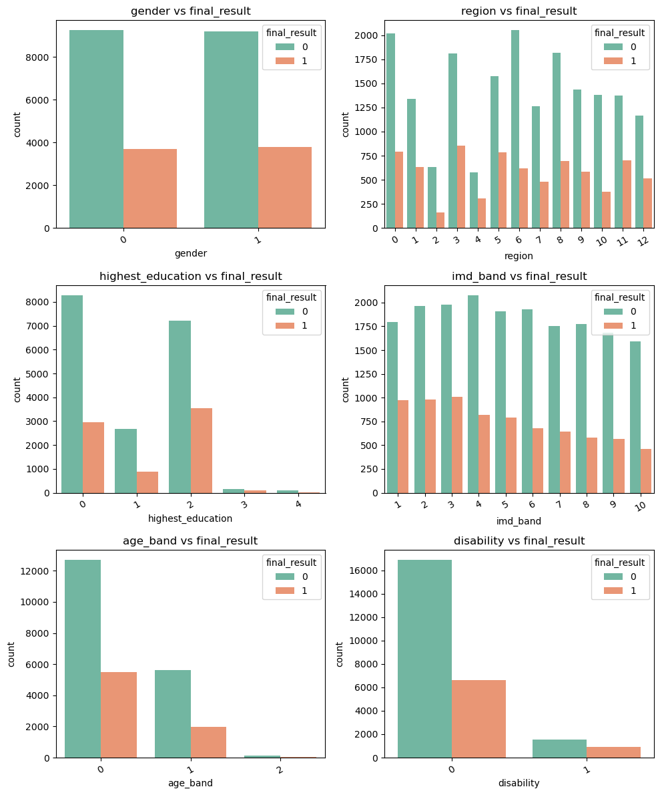

# 1. 팀소개 
### 팀명 : 👹데이터 헌터스👹
"데이터를 사냥하듯 분석하여 이탈의 원인을 찾아내는 팀"

## 팀원 소개
| 주수빈 | 임산별 | 박민정 | 김준협 | 김수현 |
|---|---|---|---|---|
|  |  |  |  |  |
|[@Subin-Ju](https://github.com/Subin-Ju)|[@ImMountainStar](https://github.com/ImMountainStar)|[@minjeon](https://github.com/minjeon)|[@use08168](https://github.com/use08168)|[@K-SH98](https://github.com/K-SH98)|

# 2. 프로젝트 개요 

# "온라인 대학 수강 플랫폼 drop(이탈) 여부 예측" #
: 온라인 대학교 강의 수강 데이터를 활용한 대학생들의 강의 drop(이탈) 여부 예측 및 대응 방안 논의

## <🚀 프로젝트 배경>

> 출처 : ['이수율 3.31%' 온라인 강의가 넘어야할 한계](https://www.globalepic.co.kr/view.php?ud=2021011021453269595796a9480c_29)

2021년, 코로나 19로 인해 온라인 수업이 확대된 지 1년 가까이 지난 시점에 나온 기사이지만, 이때 당시 온라인 강의 이수율은 불과 3.31%에 불과했습니다.  

물론 이 수치는 학점과 직결되는 대학생들의 강의, 고입/대입 진학에 좋은 성적이 필수적인 중/고등학생들의 수업 이수율 뿐만 아니라 일반 시민들이 새로운 내용을 학습하고자 수강하는 KMOOC 등의 비대면 원격 강의 이수율이 포함되었다는 점에서 정확하지 않을 수 있지만, 그럼에도 불구하고 한 강의를 100명이 듣는다고 가정했을 때 이를 수료하는 사람이 단 3명에 그친다는 것은 충격적인 결과가 아닐 수 없습니다.  

코로나가 끝난지 어언 2년차, 이제 대학에서 온라인 강의를 수강하는 모습은 거의 볼 수 없습니다. 대부분이 코로나 이전의 대면 강의로 돌아왔고, 일부 교양 / 전공 과목에서만 실시되고 있지만 이들이 강의를 이탈하지 않도록 하는 것은 대학에도 매우 중요한 부분이 아닐 수 없습니다. 학생들이 도중에 이탈하는, 소위 말하는 '강의 드랍(drop)' 행위는 대학의 등록금 반환이라는 비용 문제와 더불어 학생의 이수율과도 직결되는 문제이기 때문입니다.

## <📌 프로젝트 소개>
이에 본 프로젝트의 목적은 다음과 같습니다.

① **비용 완화** : 사전에 온라인 강의에서 이탈할 학생을 예측하여 구독 환불 비용 부담 완화  
② **수료율 향상** : 이탈 위험이 높은 학생을 확인할 시 조기 경고 및 맞춤형 지원을 통해 수료율 향상  
③ **수강 학생 유지** : 교육 기관 및 운영자 입장에서 재학생을 오래 유지할 수 있는 전략 수립 가능  

## <🎯 프로젝트 목표>
**학생의 기본 정보**를 토대로 **사전에 정확한 학생 이탈**을 예측하는 모델 개발

 

# 3. 기술스택
| **분류**         | **기술/도구**                                                                            |
|------------------|------------------------------------------------------------------------------------------|
| **언어**         |      |
| **라이브러리**   |             | 
| **머신러닝**     |  
| **협업 툴**      | 

 

# 4. WBS

 

# 5. 원본 데이터에 대한 분석
## 5-1. 원본 데이터 소개
| **데이터 이름**   |   **파일 형식 / 수집 방법**    |   **데이터 출처**      |
|:-----------------:|:-----------------------------:|:---------------------------------:|
| 대학교 강의 수강 데이터 |  csv / 직접 다운로드 | [원본 데이터](https://archive.ics.uci.edu/dataset/349/open+university+learning+analytics+dataset) |

- 본 데이터셋(Open University Learning Analytics dataset, OULAD)은 영국 오픈 유니버시티 학생들의 학습 활동과 성적, 강의 수강 정보, 그리고 온라인 학습 환경(VLE; Virtual Learning Environment)에서의 상호작용 데이터를 포함하고 있습니다.
- 구체적으로, 7개의 강의(`code_module`)에 등록한 3만명 이상의 학생들의 데이터를 다루며, 강의 정보 / 학생 정보 / 온라인 활동 / 과제 제출 및 평가 / 등록 및 이탈 등과 관련된 여러 csv 파일로 구성되어 있습니다.  

**활용한 데이터** : student_Info.csv

 

## 5-2. 원본 데이터 기본 정보 확인

### 1. 총 11개의 feature 컬럼 
| **컬럼 명** |     **컬럼 소개**   |  **컬럼 데이터 타입** |
|:-------------------:|:--------------------------------:|:------------:|
| code_module | 등록 강의 | object |
| code_presentation | 강의가 개설된 학기 구분 코드 | object |
| id_student | 학생 고유 ID | int64 |
| gender | 성별 | object |
| region | 거주 지역 | object |
| highest_education | 최고 학력 | object |
| imd_band | 다중 빈곤 지수(= 한국의 소득 1~10분위) | object |
| age_band | 연령대 | object |
| num_of_prev_attempts | 재수강하는 강의 수 | int64 |
| studied_credits | 현재 수강 학점 | int64 |
| disability | 장애 여부 | object |

### 2. target 컬럼 : 탈퇴 여부 `final_result`  
: final_result는 총 4개의 결과값( `Withdrawn(탈퇴)` / `Fail(낙제), Pass(통과), Distinction(우수 수료)` )가 존재함.

 

## 5-3. 원본 데이터 분석

 

# 6. 데이터 전처리 및 데이터 전처리 결과서 (EDA)

- final_result(Withdrawn : 1/Pass, Fail, DIsticntion : 0 → drop_status 타겟 컬럼으로 생성)
- 안쓰는 컬럼(행동 데이터)인 code_module, code_presentation, num_of_prev_attepts, studied_credits 컬럼 삭제
- 모든 컬럼 값이 같은 중복 행 제거
- 한 학생이 dropout_status 0과 1을 모두 가지고 있는 행 제거
- 범주형 변수 라벨 인코딩 진행 (gender, disability, age_band, highest_education, imd_band, region)

 

# 7. 인공지능 학습 결과서

# 8. 수행결과(테스트 결과 화면 또는 시연 페이지)

# 9. 한계점 및 보완점

##  😎**팀원 한 줄 회고**
|이름|내용|
|:---:|:---|
| 주수빈 | |
| 임산별 | |
| 김민정 | |
| 김준협 | |
| 김수현 | |

